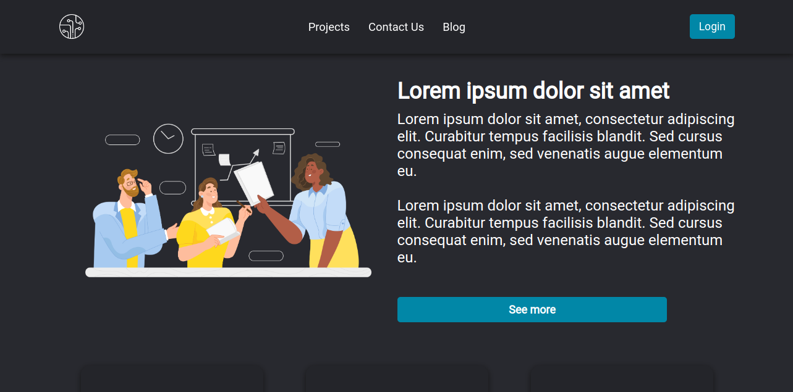
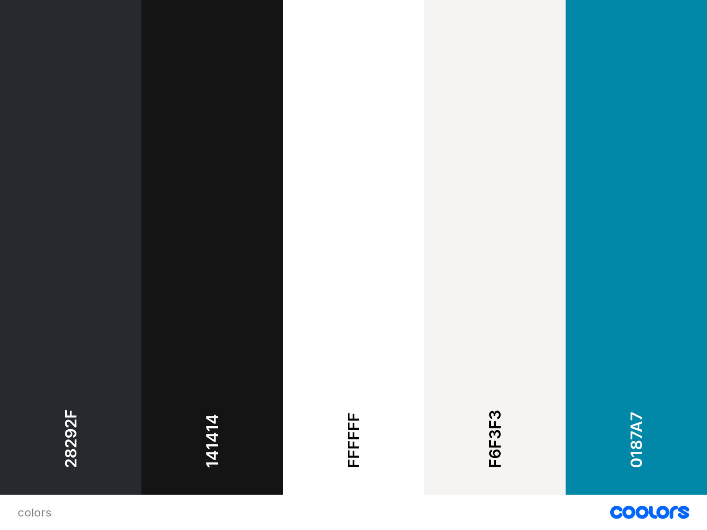

# Bem-vindo ao Tech Works! 

O desafio desse projeto foi construir uma página web responsiva apenas com HTML5, CSS3 e Javascript.

As principais habilidades colocadas prática nesse projeto foram:

* **Javascript**.
* **HTML5**
* **CSS#**;
* **Responsividade**;
* **Deploy com Vercel**;
* **ESLint**;

    


## Instalação

Para testar o projeto na sua máquina pessoal siga os seguintes passos:

1. Clone o repositório:

```sh
git@github.com:Tassio-Med/tech-works.git
```

⚠️ **Importante** ⚠️:

  - O projeto possui como dependência a biblioteca `toastify-js`, porém ela ainda não está em uso neste projeto, é apenas para continuação do desenvolvimento deste projeto em um futuro próximo. Se você quiser instalar siga a orientação abaixo:


2. Instale os pacotes npm:

```bash
npm install
```

## Desenvolvimento

O projeto [Tech Works](https://tech-works.vercel.app/) consiste na construção de um site fictício de uma empresa de tecnologia.

Na página inicial há um header responsivo que se tornar um menu hamburguer quando a tela é diminuída. Logo abaixo há seção Hero, onde seria uma espécie de introdução para o usuáriio sobre a empresa e o que ela faz. Abaixo há uma seção que representa os serviços que empresa presta e seus projetos realizados, poderia ser UX/UI, Desenvolvimento específico para Lojas online, mercado financeiro e etc.
Logo depois há uma seção que representa o trabalho da empresa em conjunto com uma frase ao lado que poderia ser a missão, por isso o texto está em itálico.

Por último há um footer com um formulário para contato e link das redes sociais da empresa.
O footer foi configurado com o [FormSubmit](https://formsubmit.co/) uma plataforma que facilita o envio de mensangens a partir de um formulário para e-mail de destinatários.

Abaixo as imagens são das duas telas em que é possível ser redirecionado:

<br>

<div align="center">

  

</div>
<br>
<div align="center">

  

</div>

 <br>

Outro ponto que acredito ser relevante é que adicionei uma página de Blog, onde seriam alguns artigos produzidos pela empresa. Toda as notícias foram puxadas da api [JSON Placeholder](https://jsonplaceholder.typicode.com/), uma API simples com texto em Lorem Ipsum.

No código adicionei um limite de 6 elementos:


```sh
fetch('https://jsonplaceholder.typicode.com/posts?_limit=6')
      .then(response => response.json())
      .then(json => console.log(json))
```

Segue abaixo uma imagem de como ficou a página de blog:

<div align="center">

  

</div>

##  Design

Para a construção visual do projeto foi CSS3 e a paleta de cores do projeto foi construída na plataforma [Coolors](https://coolors.co/). A minha meta pessoal era desenvolver um botão para o tema dark, mas por conta do tempo decidi manter o projeto com cores mais escuras.

As cores representadas abaixas estão em HEX na imagem.
<br>

<div align="center">

  

</div>

## Autor

- [@tassio medeiros](https://github.com/Tassio-Med)

[](https://linkedin.com/in/tassiomed98) 

[](https://instagram.com/tassio.med?igshid=ZDdkNTZiNTM=) 


## EsLint

Neste projeto foi utilizada extensão do [ESLint](https://eslint.org/) para fazer a análise estática do código. Ajudando a garantir a qualidade do código de forma a tê-lo mais legível, de mais fácil manutenção e seguindo as boas práticas de desenvolvimento.

<br><hr>
[🔼 Voltar topo](#bem-vindo-ao-tech-works)